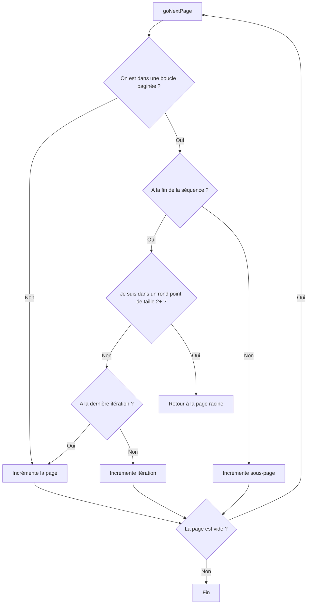

# Navigation

Par défaut le formulaire est décomposé en plusieurs pages qui peuvent être atteinte par le biais d'une navigation. L'interface visuelle de la navigation n'est pas incluse dans `@inseefr/lunatic` et c'est à l'orchestrateur d'ajouter les éléments de navigations. Le hook fournit plusieurs méthodes pour simplifier le travail.

- `goPreviousPage()`, permet de revenir en arrière d'une page
- `goNextPage()`, permet d'aller à la page suivante
- `goToPage(params: {page: string; iteration?: number; nbIterations?: number; subPage?: number;})`, permet d'aller à une page spécifique
- `isFirstPage`, indique si on est à la première page
- `isLastPage`, indique si on est à la dernière page du formulaire (on a atteind `maxPage`)
- `pageTag`, chaine de caractère représentant la page courante
- `pager`, objet contenant l'état de la navigation

## PageTag

Le page tag est une chaine de caractère permettant de représenter la position de l'utilisateur dans le formulaire et se présente de la manière suivante.

- **[page].[sous-page]#[iteration]**, quand on est dans une boucle / rond-point
- **[page]**

:::info

Les numéros de **page**, de **sous-page** et d'**itérations** commencent à **1** dans le pageTag

:::

## Pager

Le pager est un objet qui contient les informations concernant la navigation. C'est cet objet qui est utilisé en interne pour déterminer où on se trouve dans la navigation.

- `lastReachedPage` : Dernière page atteinte (optionnelle, chaîne de caractères, même format que pageTag)
- `maxPage` : Dernière page du formulaire (chaine de caractère)
- `page` : Page courante (obligatoire, chaîne de caractères)

Quand on est dans une boucle le pager aura des propriétés supplémentaires

- `subPage`, Sous-page courante
- `iteration`, Index d'itération (nombre, commençant à 0)
- `nbSubPages`, Nombre de pages dans la boucle
- `nbIterations`, Nombre d'itérations (ex: nbre de personnes)
- `shallowIteration`, TODO
- `linksIterations`, TODO

## Navigation

Afin de mieux comprendre la navigation voici un flow chart permettant de détailler l'arbre de décision lors d'une navigation vers l'avant.

